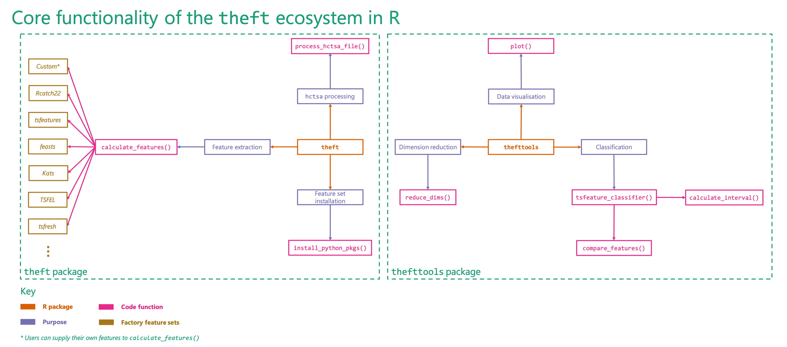

# thefttools 

Tools for Analysing and Interpreting Time Series Features

```{r, include = FALSE}
knitr::opts_chunk$set(
comment = NA, fig.width = 12, fig.height = 8, cache = FALSE)
```

## Installation

*Coming to CRAN soon!*

You can install the development version of `thefttools` from GitHub using the following:

```{r eval = FALSE}
devtools::install_github("hendersontrent/thefttools")
```

## General purpose

The [`theft`](https://hendersontrent.github.io/theft/) package for R facilitates user-friendly access to a structured analytical workflow for the extraction of time-series features from six different feature sets (or a set of user-supplied features): `"catch22"`, `"feasts"`, `"Kats"`, `"tsfeatures"`, `"tsfresh"`, and `"TSFEL"`.

`thefttools` extends this feature-based ecosystem by providing a suite of functions for analysing, interpreting, and visualising time-series features calculated using `theft`. Functionality including data quality assessments and normalisation methods, low dimensional projections (linear and nonlinear), data matrix and feature distribution visualisations, time-series classification machine learning procedures, statistical hypothesis testing, and various other statistical and graphical tools.

A high-level overview of how the `theft` ecosystem is typically accessed by users is shown below. Many more functions and options for customisation are available within the packages.



## Citation

If you use `theft` or `thefttools` in your own work, please cite both the paper:

T. Henderson and Ben D. Fulcher. [Feature-Based Time-Series Analysis in R using the theft Package](https://arxiv.org/abs/2208.06146). arXiv, (2022).

and the software:

```{r, echo = FALSE}
citation("theft")
citation("thefttools")
```
