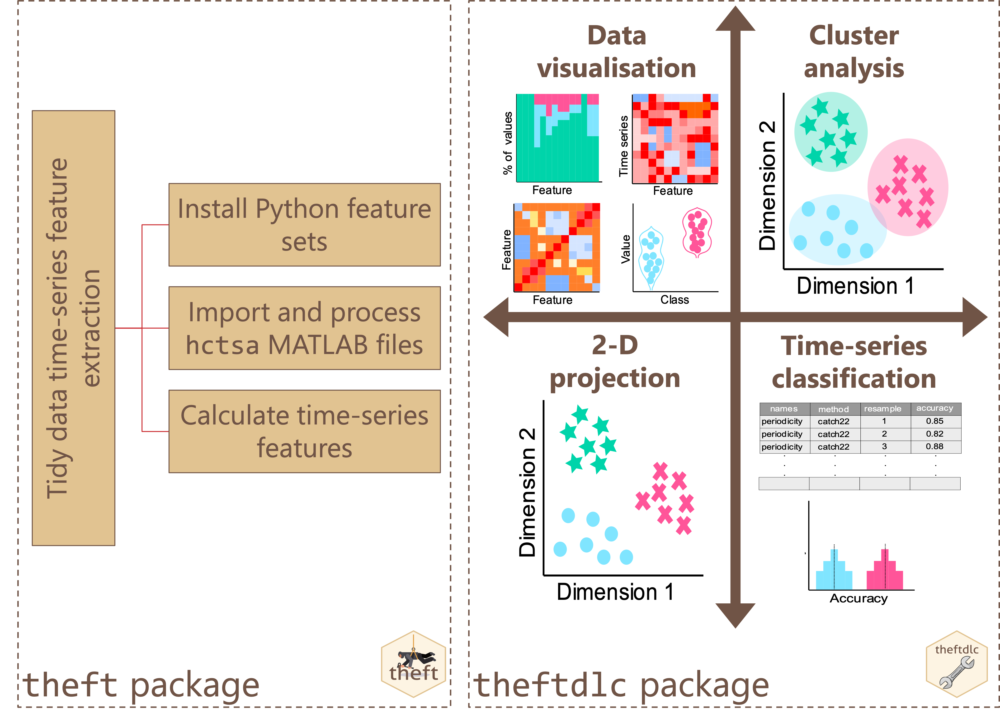
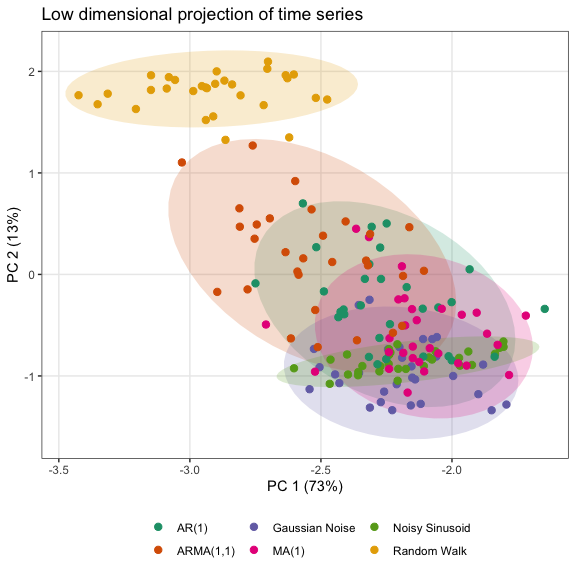

# theftdlc 

Tools for Analysing and Interpreting Time Series Features

## Installation

*Coming to CRAN soon!*

You can install the development version of `theftdlc` from GitHub using
the following:

``` r
devtools::install_github("hendersontrent/theftdlc")
```

## General purpose

The [`theft`](https://hendersontrent.github.io/theft/) package for R
facilitates user-friendly access to a structured analytical workflow for
the extraction of time-series features from six different feature sets
(or a set of user-supplied features): `"catch22"`, `"feasts"`, `"Kats"`,
`"tsfeatures"`, `"tsfresh"`, and `"TSFEL"`.

`theftdlc` extends this feature-based ecosystem by providing a suite of
functions for analysing, interpreting, and visualising time-series
features calculated using `theft`. Functionality including data quality
assessments and normalisation methods, low dimensional projections
(linear and nonlinear), data matrix and feature distribution
visualisations, time-series classification machine learning procedures,
statistical hypothesis testing, and various other statistical and
graphical tools.


A high-level overview of how the `theft` ecosystem for R is typically
accessed by users is shown below. Many more functions and options for
customisation are available within the packages.



### What’s in a name?

`theftdlc` means ‘downloadable content’ (DLC) for `theft`—just like you
get [DLCs and
expansions](https://en.bandainamcoent.eu/elden-ring/elden-ring/shadow-of-the-erdtree)
for video games.

## Quick tour

`theft` and `theftdlc` combine to create an intuitive and efficient tidy
feature-based workflow. Here is an example of a single code chunk that
calculates features using
[`catch22`](https://github.com/hendersontrent/Rcatch22) and a custom set
of mean and standard deviation, and projects the feature space into an
interpretable two-dimensional space using principal components analysis:

``` r
library(dplyr)
library(theft)
library(theftdlc)

calculate_features(data = theft::simData, 
                   group_var = "process", 
                   feature_set = "catch22",
                   features = list("mean" = mean, "sd" = sd)) %>%
  project(norm_method = "RobustSigmoid",
          unit_int = TRUE,
          low_dim_method = "PCA") %>%
  plot()
```

<!-- -->

In that example, `calculate_features` comes from `theft`, while
`project` and the `plot` generic come from `theftdlc`.

Similarly, we can perform time-series classification using a similar
simple workflow to compare the performance of `catch22` against our
custom set of the first two moments of the distribution:

``` r
calculate_features(data = theft::simData, 
                   group_var = "process", 
                   feature_set = "catch22",
                   features = list("mean" = mean, "sd" = sd)) %>%
  classify(by_set = TRUE,
           n_resamples = 5,
           use_null = TRUE) %>%
  compare_features(by_set = TRUE,
                   hypothesis = "null") %>%
  head()
```

                     hypothesis   feature_set   metric  set_mean null_mean
    1  All features != own null  All features accuracy 0.8400000 0.1688889
    2 User-supplied != own null User-supplied accuracy 0.7066667 0.1111111
    3       catch22 != own null       catch22 accuracy 0.7066667 0.1600000
      t_statistic      p.value
    1    9.089132 0.0004062310
    2    5.512023 0.0026431488
    3    7.363817 0.0009059762

In this example, `classify` and `compare_features` come from `theftdlc`.

Please see the vignette for more information and the full functionality
of both packages.

## Citation

If you use `theft` or `theftdlc` in your own work, please cite both the
paper:

T. Henderson and Ben D. Fulcher. [Feature-Based Time-Series Analysis in
R using the theft Package](https://arxiv.org/abs/2208.06146). arXiv,
(2022).

and the software:


    To cite package 'theft' in publications use:

      Trent Henderson (2024). theft: Tools for Handling Extraction of
      Features from Time Series. R package version 0.6.1.
      https://hendersontrent.github.io/theft/

    A BibTeX entry for LaTeX users is

      @Manual{,
        title = {theft: Tools for Handling Extraction of Features from Time Series},
        author = {Trent Henderson},
        year = {2024},
        note = {R package version 0.6.1},
        url = {https://hendersontrent.github.io/theft/},
      }


    To cite package 'theftdlc' in publications use:

      Trent Henderson (2024). theftdlc: Tools for Analysing and
      Interpreting Time Series Features. R package version 0.1.0.
      https://hendersontrent.github.io/theftdlc/

    A BibTeX entry for LaTeX users is

      @Manual{,
        title = {theftdlc: Tools for Analysing and Interpreting Time Series Features},
        author = {Trent Henderson},
        year = {2024},
        note = {R package version 0.1.0},
        url = {https://hendersontrent.github.io/theftdlc/},
      }
