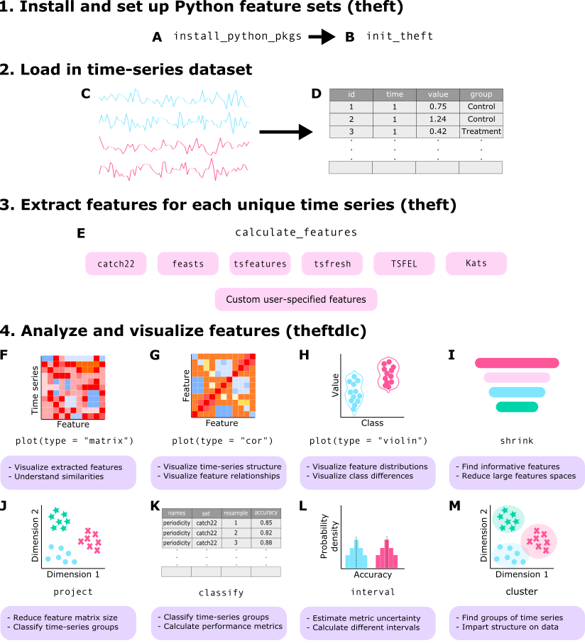
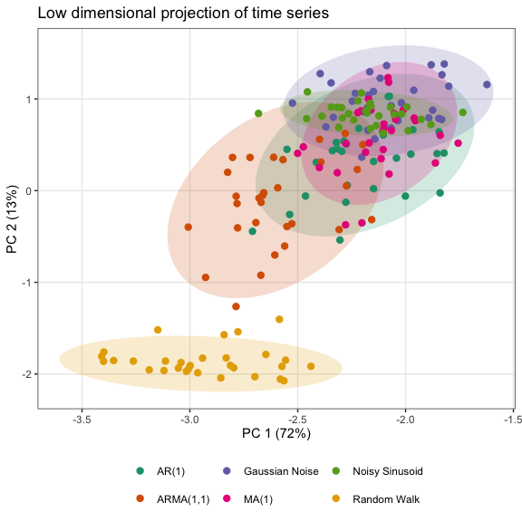

# theftdlc 

[](https://www.r-pkg.org/pkg/theftdlc)
[](https://www.r-pkg.org/pkg/theftdlc)

Analyse and Interpret Time Series Features

## Installation

You can install the stable version of `theftdlc` from CRAN:

``` r
install.packages("theftdlc")
```

You can install the development version of `theftdlc` from GitHub using
the following:

``` r
devtools::install_github("hendersontrent/theftdlc")
```

## General purpose

The [`theft`](https://hendersontrent.github.io/theft/) package for R
facilitates user-friendly access to a structured analytical workflow for
the extraction of time-series features from seven different feature sets
(and any number of individual user-supplied features): `"catch22"`,
`"feasts"`, `"kats"`, `"tsfeatures"`, `"tsfresh"`, `"tsfel"`, and
`"hctsa"`.

`theftdlc` extends this feature-based ecosystem by providing a suite of
functions for analysing, interpreting, and visualising time-series
features calculated using `theft`. Functionality including data quality
assessments and normalisation methods, low dimensional projections
(linear and nonlinear), data matrix and feature distribution
visualisations, time-series classification machine learning procedures,
statistical hypothesis testing, and various other statistical and
graphical tools.


A high-level overview of how the `theft` ecosystem for R is typically
accessed by users is shown below. Many more functions and options for
customisation are available within the packages.



### What’s in a name?

`theftdlc` means ‘downloadable content’ (DLC) for `theft`—just like you
get
[DLCs](https://en.bandainamcoent.eu/elden-ring/elden-ring/shadow-of-the-erdtree)
for video games.

## Quick tour

`theft` and `theftdlc` combine to create an intuitive and efficient tidy
feature-based workflow. Here is an example of a single code chunk that
calculates features using
[`catch22`](https://github.com/hendersontrent/Rcatch22) and a custom set
of mean and standard deviation, and projects the feature space into an
interpretable two-dimensional space using principal components analysis:

``` r
library(dplyr)
library(theft)
library(theftdlc)

calculate_features(data = theft::simData, 
                   feature_set = "catch22",
                   features = list("mean" = mean, "sd" = sd)) %>%
  project(norm_method = "RobustSigmoid",
          unit_int = TRUE,
          low_dim_method = "PCA") %>%
  plot()
```

<!-- -->

In that example, `calculate_features` comes from `theft`, while
`project` and the `plot` generic come from `theftdlc`.

Similarly, we can perform time-series classification using a similar
simple workflow to compare the performance of `catch22` against our
custom set of the first two moments of the distribution:

``` r
calculate_features(data = theft::simData, 
                   feature_set = "catch22",
                   features = list("mean" = mean, "sd" = sd)) %>%
  classify(by_set = TRUE,
           n_resamples = 5,
           use_null = TRUE) %>%
  compare_features(by_set = TRUE,
                   hypothesis = "null") %>%
  head()
```

               hypothesis feature_set   metric  set_mean  null_mean t_statistic
    1    User != own null        User accuracy 0.5466667 0.09333333    3.631296
    2 catch22 != own null     catch22 accuracy 0.7377778 0.15111111    5.794157
          p.value
    1 0.011067234
    2 0.002205415

In this example, `classify` and `compare_features` come from `theftdlc`.

Please see the vignette for more information and the full functionality
of both packages.

## Citation

If you use `theft` or `theftdlc` in your own work, please cite both the
paper:

T. Henderson and Ben D. Fulcher. [“Feature-Based Time-Series Analysis in
R using the Theft
Ecosystem”](https://journal.r-project.org/articles/RJ-2025-023/), The R
Journal, 2025.

BibTeX version:

    @article{RJ-2025-023,
      author = {Henderson, Trent and Fulcher, Ben D.},
      title = {Feature-Based Time-Series Analysis in R using the Theft Ecosystem},
      journal = {The R Journal},
      year = {2025},
      note = {https://doi.org/10.32614/RJ-2025-023},
      doi = {10.32614/RJ-2025-023},
      volume = {17},
      issue = {3},
      issn = {2073-4859},
      pages = {43-68}
    }

and the software:

    To cite package 'theft' in publications use:

      Henderson T (2025). _theft: Tools for Handling Extraction of Features
      from Time Series_. R package version 0.8.3,
      <https://hendersontrent.github.io/theft/>.

    A BibTeX entry for LaTeX users is

      @Manual{,
        title = {theft: Tools for Handling Extraction of Features from Time Series},
        author = {Trent Henderson},
        year = {2025},
        note = {R package version 0.8.3},
        url = {https://hendersontrent.github.io/theft/},
      }

    To cite package 'theftdlc' in publications use:

      Henderson T (2025). _theftdlc: Analyse and Interpret Time Series
      Features_. R package version 0.2.2,
      <https://hendersontrent.github.io/theftdlc/>.

    A BibTeX entry for LaTeX users is

      @Manual{,
        title = {theftdlc: Analyse and Interpret Time Series Features},
        author = {Trent Henderson},
        year = {2025},
        note = {R package version 0.2.2},
        url = {https://hendersontrent.github.io/theftdlc/},
      }
