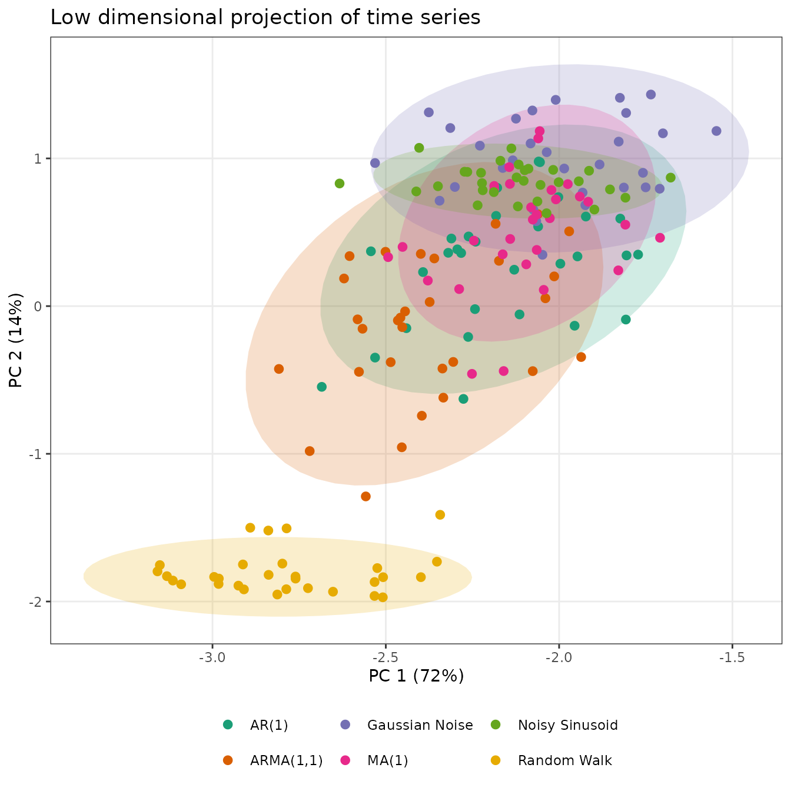
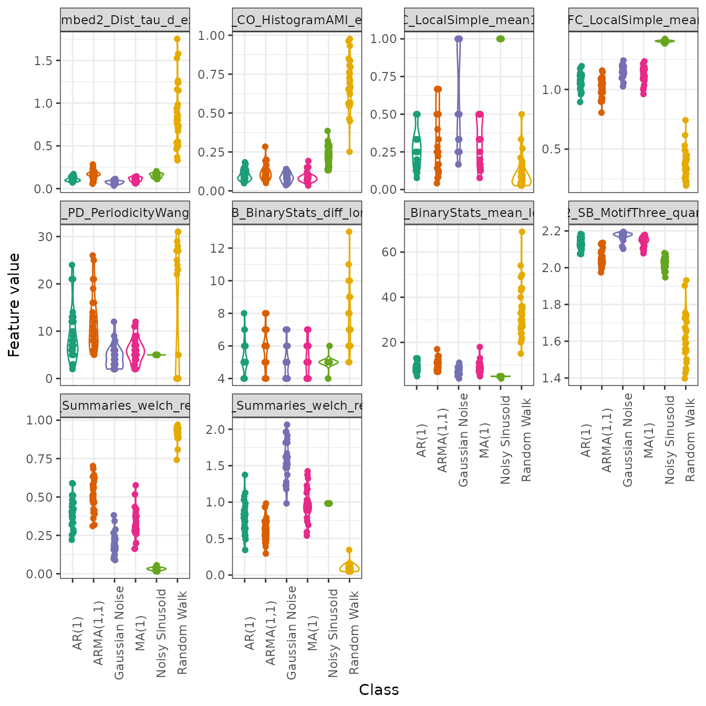

# Introduction to theftdlc

``` r
library(dplyr)
library(ggplot2)
library(theft)
library(theftdlc)
```

## Purpose

The [`theft`](https://hendersontrent.github.io/theft/) package for R
facilitates user-friendly access to a structured analytical workflow for
the extraction of time-series features from seven different feature sets
(and any number of individual user-supplied features): `"catch22"`,
`"feasts"`, `"kats"`, `"tsfeatures"`, `"tsfresh"`, `"tsfel"`, and
`"hctsa"`. `theftdlc` extends this feature-based ecosystem by providing
a suite of functions for analysing, interpreting, and visualising
time-series features calculated using `theft`.

Please see our recent paper [“Feature-Based Time-Series Analysis in R
using the Theft
Ecosystem”](https://journal.r-project.org/articles/RJ-2025-023/) for
more information.

## Core calculation functions

To explore package functionality, we are going to use a dataset that
comes standard with `theft` called `simData`. This dataset is a
`tsibble` which contains a collection of randomly generated time series
for six different types of processes. The dataset can be accessed via:

``` r
theft::simData
```

The data follows the following structure:

``` r
head(simData)
#> # A tsibble: 6 x 4 [1]
#> # Key:       id, process [1]
#>     values timepoint id      process
#>      <dbl>     <int> <chr>   <chr>  
#> 1  0.0918          1 AR(1)_1 AR(1)  
#> 2  0.00617         2 AR(1)_1 AR(1)  
#> 3  0.154           3 AR(1)_1 AR(1)  
#> 4  0.100           4 AR(1)_1 AR(1)  
#> 5 -0.0219          5 AR(1)_1 AR(1)  
#> 6 -0.230           6 AR(1)_1 AR(1)
```

We will use `theft` to quickly calculate features using the `catch22`
set:

``` r
feature_matrix <- calculate_features(data = simData, 
                                     feature_set = "catch22")
```

## Data quality checks

The core `calculate_features` function in `theft` returns an object of
class `feature_calculations`. Objects of this type are purposefully
looked-for by other functions in `theftdlc`. Because it is a class,
simple methods such as
[`plot()`](https://rdrr.io/r/graphics/plot.default.html) can be called
on the object to produce a range of statistical graphics. The first is a
visualisation of the data types of the calculated feature vectors. This
is useful for inspecting which features might need to be dropped due to
large proportions of undesirable (e.g., `NA`, `NaN` etc.) values. We can
specify the plot `type = "quality` to make this graphic:

``` r
plot(feature_matrix, type = "quality")
```


## Data visualisation and low-dimensional projections

The package also comes with additional statistical and graphical
functionality:

- Feature by time-series matrix as a heatmap
- Low dimensional projections of the feature space and plotting as a
  scatterplot
- Pairwise feature correlation matrix as a heatmap

### Feature matrices

The function calling `type = "matrix"` in
[`plot()`](https://rdrr.io/r/graphics/plot.default.html) on a
`feature_calculations` object takes it and produces a `ggplot` object
heatmap showing the feature vectors across the `x` axis and each time
series down the `y` axis. Prior to plotting, the function hierarchically
clusters the data across both rows and columns to visually highlight the
empirical structure. Note that you have several options for the
hierarchical clustering linkage algorithm to use:

- `"average"` (default)
- `"ward.D"`
- `"ward.D2"`
- `"single"`
- `"complete"`
- `"mcquitty"`
- `"median"`
- `"centroid"`

See the [`hclust`
documentation](https://www.rdocumentation.org/packages/stats/versions/3.6.2/topics/hclust)
for more information.

Note that the legend for this plot (and other matrix visualisations in
`theftdlc`) have been discretised for visual clarity as continuous
legends can be difficult to interpret meaningful value differences
easily.

``` r
plot(feature_matrix, type = "matrix", norm_method = "RobustSigmoid")
```


You can control the normalisation type with the `norm_method` argument,
whether to rescale to the unit interval after normalisation with the
`unit_int` argument. `norm_method` and all normalisation of feature
vectors in `theftdlc` is handled by the
[`normaliseR`](https://hendersontrent.github.io/normaliseR/) package.
You can also control the hierarchical clustering method with the
`clust_method` argument (the example above used defaults so manual
specification was not needed).

### Individual feature distributions

Plotting the entire feature matrix is useful, but sometimes we wish to
understand the distributions of individual features. This is
particularly useful if there are different groups in your data (such as
in a time-series classification context). We can again use the
[`plot()`](https://rdrr.io/r/graphics/plot.default.html) generic here to
draw violin plots through setting `type = "violin"`. Note that for
violin plots, we also need to tell the function which features we wish
to plot (i.e., a vector of characters specifying feature names from the
`names` column in your `feature_calculations` object). For simplicity,
we will just plot two random features from `catch22` here:

``` r
plot(feature_matrix, type = "violin",
     feature_names = c("CO_f1ecac", "PD_PeriodicityWang_th0_01"))
```


Note that when using these defined
[`plot()`](https://rdrr.io/r/graphics/plot.default.html) generics, you
can pass any additional arguments to certain geoms to control the plot
look through the `...` argument in the
[`plot()`](https://rdrr.io/r/graphics/plot.default.html) function. Below
is a guide to where these arguments go depending on the plot type:

- `type = "quality"`—`...` goes to
  [`ggplot2::geom_bar`](https://ggplot2.tidyverse.org/reference/geom_bar.html)
- `type = "matrix"`—`...` goes to
  [`ggplot2::geom_raster`](https://ggplot2.tidyverse.org/reference/geom_tile.html)
- `type = "cor"`—`...` goes to
  [`ggplot2::geom_raster`](https://ggplot2.tidyverse.org/reference/geom_tile.html)
- `type = "violin"`—`...` goes to
  [`ggplot2::geom_point`](https://ggplot2.tidyverse.org/reference/geom_point.html)
- `type = "box"`—`...` goes to
  [`ggplot2::geom_boxplot`](https://ggplot2.tidyverse.org/reference/geom_boxplot.html)

For example, we may wish to control the point size and transparency in
the above plot (not rendered here for space):

``` r
plot(feature_matrix, type = "violin",
     feature_names = c("CO_f1ecac", "PD_PeriodicityWang_th0_01"),
     size = 0.7, alpha = 0.9)
```

Alternatively, we may wish to identify if any univariate outliers exist
by drawing a boxplot instead, which depicts outliers as points:

``` r
plot(feature_matrix, type = "box",
     feature_names = c("CO_f1ecac", "PD_PeriodicityWang_th0_01"))
```


### Low dimensional projections

Low-dimensional projections are a useful tool for visualising the
structure of high-dimensional datasets in low-dimensional spaces. In
machine learning for time-series data, we are often interested in
representing a time-series dataset in a two-dimensional projection of
the high-dimensional feature space. This projection which can reveal
structure in the dataset, including how different labeled classes are
organized.

The `theftdlc` function `project` takes the `feature_calculations`
object and performs one of the following dimension reduction techniques
on it to reduce its dimensionality to a bivariate state which can then
be easily plotted:

- Principal components analysis (PCA)—`"PCA"`
- $t$-Stochastic Neighbor Embedding ($t$-SNE)—`"tSNE"`
- Classical multidimensional scaling (MDS)—`"ClassicalMDS"`
- Kruskal’s non-metric multidimensional scaling—`"KruskalMDS"`
- Sammon’s non-linear mapping non-metric multidimensional
  scaling—`"SammonMDS"`
- Uniform Manifold Approximation and Projection for Dimension Reduction
  (UMAP)—`"UMAP"`

The result is stored in a custom object class called
`feature_projection`. `project` takes the following arguments:

- `data`—`feature_calculations` object containing the raw feature matrix
  produced by
  [`theft::calculate_features`](https://hendersontrent.github.io/theft/reference/calculate_features.html)
- `norm_method`—character denoting the rescaling/normalising method to
  apply. Can be one of `"zScore"`, `"Sigmoid"`, `"RobustSigmoid"`,
  `"MinMax"`, or `"MaxAbs"`. Defaults to `"zScore"`
- `unit_int`—Boolean whether to rescale into unit interval
  $\lbrack 0,1\rbrack$ after applying normalisation method. Defaults to
  `FALSE`
- `low_dim_method`—character specifying the low dimensional embedding
  method to use. Can be one of `"PCA"` or `"tSNE"`, `"ClassicalMDS"`,
  `"KruskalMDS"`, `"SammonMDS"`, or `"UMAP"`. Defaults to `"PCA"`
- `na_removal`—character defining the way to deal with `NAs` produced
  during feature calculation. Can be one of `"feature"` or `"sample"`.
  `"feature"` removes all features that produced any `NAs` in any
  sample, keeping the number of samples the same. `"sample"` omits all
  samples that produced at least one `NA`. Defaults to `"feature"`
- `seed`—integer to fix R’s random number generator to ensure
  reproducibility. Defaults to `123`
- `...` arguments to be passed to the respective function specified by
  `low_dim_method`

`project` returns an object of class `feature_projection` which is
essentially a named list comprised of four elements:

1.  `"Data"`—the `feature_calculations` object supplied to `project`
2.  `"ModelData"`—the wide matrix of filtered data supplied to the model
    fit
3.  `"ProjectedData"`—a tidy `data.frame` of the two-dimensional
    embedding
4.  `"ModelFit"`—the raw model object from the dimensionality reduction
    algorithm

``` r
low_dim <- project(feature_matrix,
                   norm_method = "RobustSigmoid",
                   unit_int = TRUE,
                   low_dim_method = "PCA",
                   seed = 123)
```

We can similarly call
[`plot()`](https://rdrr.io/r/graphics/plot.default.html) on this object
to produce a two-dimensional scatterplot of the results:

``` r
plot(low_dim)
```



As another example, a *t*-SNE version can be specified in a similar
fashion, with any function parameters for the method supplied to the
`...` argument to `project`. Shaded covariance ellipses can also be
disabled when plotting `feature_projection` objects by setting
`show_covariance = FALSE`. Here is an example where we modify the
perplexity of the *t*-SNE algorithm:

``` r
low_dim2 <- project(feature_matrix,
                    norm_method = "RobustSigmoid",
                    unit_int = TRUE,
                    low_dim_method = "tSNE",
                    perplexity = 10,
                    seed = 123)

plot(low_dim2, show_covariance = FALSE)
```


### Pairwise correlations

You can plot correlations between feature vectors using
`plot(type = "cor")` on a `feature_calculations` object:

``` r
plot(feature_matrix, type = "cor")
```


Similarly, you can control the normalisation type with the `norm_method`
argument and the hierarchical clustering method with the `clust_method`
argument (the example above used defaults so manual specification was
not needed).

## Time-series classification

### Feature-by-feature

Since feature-based time-series analysis has shown particular promise
for classification problems, `theftdlc` includes functionality for
exploring group separation. The function `classify` enables you to fit a
range of classification models to enable statistical comparisons using
the resampling methodology presented in [this
paper](https://arxiv.org/abs/2303.17809). This function is meant to
serve as a fast answer that can be used to guide analysis and not a
replacement for the development of a bespoke statistical pipeline.
`classify` has the following arguments:

- `data`—`feature_calculations` object containing the raw feature matrix
  produced by
  [`theft::calculate_features`](https://hendersontrent.github.io/theft/reference/calculate_features.html)
  with an included `group` column as per
  [`theft::calculate_features`](https://hendersontrent.github.io/theft/reference/calculate_features.html)
- `tt_labels`—`data.frame` containing data with two columns: an `id`
  column whose values that aligns with the id column in `data` and a
  column for train-test designation of each id named `set_split` where
  entries are `"Train"` or `"Test"`. Defaults to `NULL`. If
  `tt_labels = NULL`, labels will be created by constructing a new
  train-test split using `train_size`
- `classifier`—`function` specifying the classifier to fit. Should be a
  function with 2 arguments: `formula` and `data`. Please note that
  `classify` z-scores data prior to modelling using the train set’s
  information so disabling default scaling if your function uses it is
  recommended. Defaults to `NULL` which means the following linear SVM
  is fit:
  `classifier = function(formula, data){mod <- e1071::svm(formula, data = data, kernel = "linear", scale = FALSE, probability = TRUE)}`
- `train_size`—Numeric value denoting the proportion of samples to use
  in the training set. Defaults to `0.75`
- `n_resamples`—Integer denoting the number of resamples to calculate.
  Defaults to `30`
- `by_set`—Boolean specifying whether to compute classifiers for each
  feature set. Defaults to `TRUE` (see below section “Multi-feature” for
  more on this). If `FALSE`, the function will instead find the best
  individually-performing features
- `use_null`—Boolean whether to fit null models where class labels are
  shuffled in order to generate a null distribution that can be compared
  to performance on correct class labels. Defaults to `FALSE`. This is
  known as permutation testing
- `filter_duplicates`—Boolean denoting whether to filter duplicate
  features when `by_set = FALSE` or not. Only useful for determining top
  individual unique features for a problem. Defaults to `FALSE`
- `add_all_features`—Boolean denoting whether to construct a composite
  set of all features to use as a comparison. Only applicable if
  `by_set = TRUE`. Defaults to `FALSE`
- `n_workers`—integer denoting the number of parallel processes to use.
  Likely only beneficial for smaller datasets. Defaults to `1` for
  serial processing
- `seed`—Integer to fix R’s random number generator to ensure
  reproducibility. Defaults to `123`

Since we are interested in individual features in this section, we will
calculate both main and null results for each feature using just `5`
resamples for efficiency (in practice, we would use more!) with the
default linear SVM:

``` r
feature_classifiers <- classify(feature_matrix,
                                by_set = FALSE,
                                n_resamples = 5,
                                use_null = TRUE)
```

To show you how simple it is to specify a different classifier, we can
instead maybe use a radial basis function SVM (though you are absolutely
not limited to just `e1071` models! You can use anything that can be
used with R’s `predict` generic as `classify` internally constructs
confusion matrices from model predictions):

``` r
myclassifier <- function(formula, data){
  mod <- e1071::svm(formula, data = data, kernel = "radial", scale = FALSE,
                    probability = TRUE)
}

feature_classifiers_radial <- classify(feature_matrix,
                                       classifier = myclassifier,
                                       by_set = FALSE,
                                       n_resamples = 5,
                                       use_null = TRUE)
```

While have raw classification results is useful, we often also would
like to statistical evaluate some facet of it. `theftdlc` includes the
function `compare_features` for doing this. `compare_features` contains
the following arguments:

- `data`—List object containing the classification outputs produce by
  `classify`
- `metric`—Character denoting the classification performance metric to
  use in statistical testing. Can be one of `"accuracy"`, `"precision"`,
  `"recall"`, `"f1"`. Defaults to `"accuracy"`
- `by_set`—Boolean specifying whether you want to compare feature sets
  (if `TRUE`) or individual features (if `FALSE`). Defaults to `TRUE`
  but this is contingent on whether you computed by set or not in
  `classify`
- `hypothesis`—Character denoting whether p-values should be calculated
  for each feature set or feature (depending on `by_set` argument)
  individually relative to the null if `use_null = TRUE` in `classify`
  through `"null"`, or whether pairwise comparisons between each set or
  feature should be conducted on main model fits only through
  `"pairwise"`. Defaults to `"null"`
- `p_adj`—Character denoting the adjustment made to p-values for
  multiple comparisons. Should be a valid argument to
  [`stats::p.adjust`](https://www.rdocumentation.org/packages/stats/versions/3.6.2/topics/p.adjust).
  Defaults to `"none"` for no adjustment. `"holm"` is recommended as a
  starting point if adjustments are sought
- `n_workers`—Integer denoting the number of parallel processes to use.
  Defaults to `1` for serial processing

We can use `compare_features` to evaluate how well each individual
feature performs relative to its empirical null distribution (noting
that we are using the defaults for the other arguments for code
cleanliness):

``` r
feature_vs_null <- compare_features(feature_classifiers,
                                    by_set = FALSE,
                                    hypothesis = "null")

head(feature_vs_null)
#>                                                 hypothesis
#> 1 catch22_CO_Embed2_Dist_tau_d_expfit_meandiff != own null
#> 2                            catch22_CO_f1ecac != own null
#> 3                       catch22_CO_FirstMin_ac != own null
#> 4             catch22_CO_HistogramAMI_even_2_5 != own null
#> 5                        catch22_CO_trev_1_num != own null
#> 6                  catch22_DN_HistogramMode_10 != own null
#>                                          names
#> 1 catch22_CO_Embed2_Dist_tau_d_expfit_meandiff
#> 2                            catch22_CO_f1ecac
#> 3                       catch22_CO_FirstMin_ac
#> 4             catch22_CO_HistogramAMI_even_2_5
#> 5                        catch22_CO_trev_1_num
#> 6                  catch22_DN_HistogramMode_10
#>                         original_names feature_set   metric feature_mean
#> 1 CO_Embed2_Dist_tau_d_expfit_meandiff     catch22 accuracy    0.3333333
#> 2                            CO_f1ecac     catch22 accuracy    0.3555556
#> 3                       CO_FirstMin_ac     catch22 accuracy    0.3022222
#> 4             CO_HistogramAMI_even_2_5     catch22 accuracy    0.3688889
#> 5                        CO_trev_1_num     catch22 accuracy    0.1377778
#> 6                  DN_HistogramMode_10     catch22 accuracy    0.0800000
#>    null_mean t_statistic     p.value
#> 1 0.05777778   4.7002079 0.004653485
#> 2 0.06222222          NA          NA
#> 3 0.11111111   1.8874905 0.066066436
#> 4 0.07111111   2.4319459 0.035914947
#> 5 0.07555556   1.7232809 0.079967399
#> 6 0.10222222  -0.3892495 0.641537068
```

Or to conduct pairwise comparisons between individual features:

``` r
pairwise_features <- compare_features(feature_classifiers,
                                      by_set = FALSE,
                                      hypothesis = "pairwise",
                                      p_adj = "holm")

head(pairwise_features)
#>                                                                         hypothesis
#> 1                catch22_CO_Embed2_Dist_tau_d_expfit_meandiff != catch22_CO_f1ecac
#> 2           catch22_CO_Embed2_Dist_tau_d_expfit_meandiff != catch22_CO_FirstMin_ac
#> 3 catch22_CO_Embed2_Dist_tau_d_expfit_meandiff != catch22_CO_HistogramAMI_even_2_5
#> 4            catch22_CO_Embed2_Dist_tau_d_expfit_meandiff != catch22_CO_trev_1_num
#> 5      catch22_CO_Embed2_Dist_tau_d_expfit_meandiff != catch22_DN_HistogramMode_10
#> 6       catch22_CO_Embed2_Dist_tau_d_expfit_meandiff != catch22_DN_HistogramMode_5
#>                                        names_a                          names_b
#> 1 catch22_CO_Embed2_Dist_tau_d_expfit_meandiff                catch22_CO_f1ecac
#> 2 catch22_CO_Embed2_Dist_tau_d_expfit_meandiff           catch22_CO_FirstMin_ac
#> 3 catch22_CO_Embed2_Dist_tau_d_expfit_meandiff catch22_CO_HistogramAMI_even_2_5
#> 4 catch22_CO_Embed2_Dist_tau_d_expfit_meandiff            catch22_CO_trev_1_num
#> 5 catch22_CO_Embed2_Dist_tau_d_expfit_meandiff      catch22_DN_HistogramMode_10
#> 6 catch22_CO_Embed2_Dist_tau_d_expfit_meandiff       catch22_DN_HistogramMode_5
#>     metric names_a_mean names_b_mean t_statistic    p.value p_value_adj
#> 1 accuracy    0.3333333    0.3555556          NA         NA          NA
#> 2 accuracy    0.3333333    0.3022222   0.9525793 0.39474545   1.0000000
#> 3 accuracy    0.3333333    0.3688889  -0.5819144 0.59184415   1.0000000
#> 4 accuracy    0.3333333    0.1377778   4.4907312 0.01089970   1.0000000
#> 5 accuracy    0.3333333    0.0800000   5.7287155 0.00459701   0.7768946
#> 6 accuracy    0.3333333    0.1022222   4.8702462 0.00821823   1.0000000
```

*NOTE: Although it was not used in this vignette for simplicity, it is
strongly recommended to use parallel processing in* `compare_features`
*by setting* `n_workers` $> 1$. *Performance benefits will be especially
pronounced for pairwise comparisons.*

We can then use `ggplot2` to summarise and visualise our results. Here
is a pairwise correlation plot between the top 10 features in `catch22`
for this toy problem. We are just simply filtering the original full
feature data and making use of the `plot` generic defined for objects of
class `feature_calculations`:

``` r
top_10 <- feature_vs_null %>%
  dplyr::slice_min(p.value, n = 10) %>%
  dplyr::select(c(feature_set, original_names, p.value))

feature_matrix_filt <- feature_matrix %>%
  dplyr::filter(feature_set %in% top_10$feature_set & names %in% top_10$original_names)

feature_matrix_filt <- structure(feature_matrix_filt, class = c("feature_calculations", "data.frame"))
plot(feature_matrix_filt, type = "cor")
```


We can also easily draw a violin plot of the top 10 features to
visualise the distributions by group:

``` r
plot(feature_matrix_filt,
     type = "violin",
     feature_names = top_10$original_names)
```



`theftdlc` also contains a function `interval` for summarising the
results of `classify`. `interval` returns an object of class
`interval_calculations` which is a data frame containing the summary
information. `interval` takes the following arguments:

- `data`—list object containing the classification outputs produce by
  `classify`
- `metric`—character denoting the classification performance metric to
  calculate intervals for. Can be one of `"accuracy"`, `"precision"`,
  `"recall"`, `"f1"`. Defaults to `"accuracy"`
- `by_set`—Boolean specifying whether to compute intervals for each
  feature set. Defaults to `TRUE`. If `FALSE`, the function will instead
  calculate intervals for each feature
- `type`—character denoting whether to calculate a $\pm$ SD interval
  with `"sd"`, confidence interval based off the $t$-distribution with
  `"se"`, or based on a quantile with `"quantile"`. Defaults to `"sd"`
- `interval`—numeric scalar denoting the width of the interval to
  calculate. Defaults to `1` if `type = "sd"` to produce a $\pm 1$ SD
  interval. Defaults to `0.95` if `type = "se"` or `type = "quantile"`
  for a $95\%$ interval
- `model_type`—character denoting whether to calculate intervals for
  main models with `"main"` or null models with `"null"` if the
  `use_null` argument when using `classify` was `use_null = TRUE`.
  Defaults to `"main"`

We can evidently use `interval` to produce a variety of different
summaries for us. For example, we might wish to compute the $\pm 1$ SD
interval for each feature’s main model classification accuracy values
(note that the defaults for the function do this for us, so we only need
to set `by_set = FALSE` manually):

``` r
interval(feature_classifiers, by_set = FALSE)
#>                                                  names      .mean     .lower
#> 1         catch22_CO_Embed2_Dist_tau_d_expfit_meandiff 0.33333333 0.31111111
#> 2                                    catch22_CO_f1ecac 0.35555556 0.35555556
#> 3                               catch22_CO_FirstMin_ac 0.30222222 0.26185355
#> 4                     catch22_CO_HistogramAMI_even_2_5 0.36888889 0.32852022
#> 5                                catch22_CO_trev_1_num 0.13777778 0.11343455
#> 6                          catch22_DN_HistogramMode_10 0.08000000 0.05018576
#> 7                           catch22_DN_HistogramMode_5 0.10222222 0.04427376
#> 8                catch22_DN_OutlierInclude_n_001_mdrmd 0.08888889 0.07317540
#> 9                catch22_DN_OutlierInclude_p_001_mdrmd 0.09777778 0.07244055
#> 10              catch22_FC_LocalSimple_mean1_tauresrat 0.46222222 0.39858746
#> 11                 catch22_FC_LocalSimple_mean3_stderr 0.56444444 0.53910721
#> 12     catch22_IN_AutoMutualInfoStats_40_gaussian_fmmi 0.19111111 0.15740944
#> 13                        catch22_MD_hrv_classic_pnn40 0.21777778 0.17503248
#> 14                   catch22_PD_PeriodicityWang_th0_01 0.25777778 0.22059289
#> 15            catch22_SB_BinaryStats_diff_longstretch0 0.21777778 0.15814930
#> 16            catch22_SB_BinaryStats_mean_longstretch1 0.29333333 0.27474089
#> 17                   catch22_SB_MotifThree_quantile_hh 0.40000000 0.35030960
#> 18          catch22_SB_TransitionMatrix_3ac_sumdiagcov 0.24444444 0.22873096
#> 19      catch22_SC_FluctAnal_2_dfa_50_1_2_logi_prop_r1 0.11111111 0.06397066
#> 20 catch22_SC_FluctAnal_2_rsrangefit_50_1_logi_prop_r1 0.13777778 0.10126294
#> 21            catch22_SP_Summaries_welch_rect_area_5_1 0.68888889 0.65039887
#> 22            catch22_SP_Summaries_welch_rect_centroid 0.45777778 0.39185601
#>       .upper
#> 1  0.3555556
#> 2  0.3555556
#> 3  0.3425909
#> 4  0.4092576
#> 5  0.1621210
#> 6  0.1098142
#> 7  0.1601707
#> 8  0.1046024
#> 9  0.1231150
#> 10 0.5258570
#> 11 0.5897817
#> 12 0.2248128
#> 13 0.2605231
#> 14 0.2949627
#> 15 0.2774063
#> 16 0.3119258
#> 17 0.4496904
#> 18 0.2601579
#> 19 0.1582516
#> 20 0.1742926
#> 21 0.7273789
#> 22 0.5236995
```

### Multi-feature

Since `theft` contains entire sets of features, we can also use
`classify` to compare them at the set level through the `by_set`
argument. Let’s try both `catch22` and a custom set of just mean and
standard deviation:

``` r
feature_matrix2 <- calculate_features(data = simData, 
                                      feature_set = "catch22",
                                      features = list("mean" = mean, "sd" = sd),
                                      seed = 123)

set_classifiers <- classify(feature_matrix2,
                            by_set = TRUE,
                            n_resamples = 5,
                            use_null = TRUE,
                            add_all_features = TRUE)

head(set_classifiers)
#> $TrainTestSizes
#> train_size  test_size 
#>        135         45 
#> 
#> $ClassificationResults
#>    model_type resample   accuracy mean_precision mean_recall mean_f1_score
#> 1        Main        1 0.84444444     0.86574074  0.88827839     0.8682359
#> 2        Main        2 0.91111111     0.92592593  0.92592593     0.9259259
#> 3        Main        3 0.75555556     0.79166667  0.81649832     0.8002646
#> 4        Main        4 0.77777778     0.81018519  0.81693122     0.8126706
#> 5        Main        5 0.80000000     0.83333333  0.83333333     0.8328173
#> 6        Null        1 0.13333333     0.19490741  0.11458333     0.1980420
#> 7        Null        2 0.13333333     0.14709596  0.17216811     0.1527193
#> 8        Null        3 0.08888889     0.08888889  0.11309524     0.2986111
#> 9        Null        4 0.33333333     0.36582492  0.36984127     0.3244168
#> 10       Null        5 0.13333333     0.10332492  0.16730769     0.2411616
#> 11       Main        1 0.82222222     0.85185185  0.85281385     0.8500000
#> 12       Main        2 0.77777778     0.81481481  0.81481481     0.8148148
#> 13       Main        3 0.75555556     0.79629630  0.79583333     0.7956656
#> 14       Main        4 0.82222222     0.85185185  0.85281385     0.8500000
#> 15       Main        5 0.80000000     0.83333333  0.83333333     0.8285714
#> 16       Null        1 0.11111111     0.16666667  0.23809524     0.8333333
#> 17       Null        2 0.26666667     0.33333333  0.30912162     0.4683794
#> 18       Null        3 0.08888889     0.13333333  0.20000000     0.8000000
#> 19       Null        4 0.11111111     0.16666667  0.31250000     0.7692308
#> 20       Null        5 0.02222222     0.05555556  0.05555556     0.2222222
#> 21       Main        1 0.77777778     0.79537037  0.78860029     0.7878788
#> 22       Main        2 0.82222222     0.84953704  0.83201058     0.8373812
#> 23       Main        3 0.66666667     0.68564815  0.71801347     0.6931883
#> 24       Main        4 0.71111111     0.75462963  0.73547980     0.7180744
#> 25       Main        5 0.77777778     0.80000000  0.79814815     0.7901961
#> 26       Null        1 0.13333333     0.15787037  0.11428571     0.2346154
#> 27       Null        2 0.08888889     0.07302189  0.11666667     0.1300595
#> 28       Null        3 0.11111111     0.10740741  0.15714286     0.2511905
#> 29       Null        4 0.26666667     0.24936869  0.27910053     0.2931502
#> 30       Null        5 0.08888889     0.06965488  0.12777778     0.1790598
#>     feature_set
#> 1  All features
#> 2  All features
#> 3  All features
#> 4  All features
#> 5  All features
#> 6  All features
#> 7  All features
#> 8  All features
#> 9  All features
#> 10 All features
#> 11         User
#> 12         User
#> 13         User
#> 14         User
#> 15         User
#> 16         User
#> 17         User
#> 18         User
#> 19         User
#> 20         User
#> 21      catch22
#> 22      catch22
#> 23      catch22
#> 24      catch22
#> 25      catch22
#> 26      catch22
#> 27      catch22
#> 28      catch22
#> 29      catch22
#> 30      catch22
```

Note that `classify` constructs a set of `"All features"` (i.e., all
features across all computed sets) automatically when $> 2$ unique
feature sets are detected in the feature data. Since `interval` returns
an S3 object, we can use the `plot` generic to automatically draw a
useful visual summary:

``` r
interval_calcs <- interval(set_classifiers)

plot(interval_calcs)
```


## Cluster analysis

`theftdlc` also supports quick and simple cluster analysis using either
[$k$-means](https://en.wikipedia.org/wiki/K-means_clustering),
hierarchical clustering, or [Gaussian mixture
models](https://en.wikipedia.org/wiki/Mixture_model) through the
`cluster` function. `cluster` takes a few similar key arguments to other
`theftdlc` functions (though defaults are set for all, and so only
`data` is required for `cluster` to work):

- `data`—`feature_calculations` object containing the raw feature matrix
  produced by
  [`theft::calculate_features`](https://hendersontrent.github.io/theft/reference/calculate_features.html)
- `norm_method`—character denoting the rescaling/normalising method to
  apply. Can be one of `"zScore"`, `"Sigmoid"`, `"RobustSigmoid"`,
  `"MinMax"`, or `"MaxAbs"`. Defaults to `"zScore"`
- `unit_int`—Boolean whether to rescale into unit interval
  $\lbrack 0,1\rbrack$ after applying normalisation method. Defaults to
  `FALSE`
- `clust_method`—character specifying the clustering algorithm to use.
  Can be one of `"kmeans"`, `"hclust"`, or `"mclust"`. Defaults to
  `"kmeans"`
- `k`—integer denoting the number of clusters to extract. Defaults to
  `2`
- `features`—character vector denoting the names of time-series features
  to use in the clustering algorithm. Defaults to `NULL` for no feature
  filtering and usage of the entire feature matrix
- `na_removal`—character defining the way to deal with `NAs` produced
  during feature calculation. Can be one of `"feature"` or `"sample"`.
  `"feature"` removes all features that produced any `NAs` in any
  sample, keeping the number of samples the same. `"sample"` omits all
  samples that produced at least one `NA`. Defaults to `"feature"`
- `seed`—integer to fix R’s random number generator to ensure
  reproducibility. Defaults to `123`
- `...`—additional arguments to be passed to
  [`stats::kmeans`](https://rdrr.io/r/stats/kmeans.html),
  [`stats::hclust`](https://rdrr.io/r/stats/hclust.html), or
  [`mclust::Mclust`](https://mclust-org.github.io/mclust/reference/Mclust.html)
  depending on `clust_method`

`cluster` returns an object of class `feature_clusters` which is
essentially a named list comprised of two elements:

1.  `"Data"`—the `feature_calculations` object supplied to `cluster`
    with the cluster label appended
2.  `"ModelFit"`—the raw model object from the clustering algorithm

We can easily fit a $k$-means model with `k = 6` (since
[`theft::simData`](https://hendersontrent.github.io/theft/reference/simData.html)
contains data for six different temporal processes):

``` r
feature_clusters <- cluster(feature_matrix, k = 6)
```

From here, it’s easy to do any further analysis or data visualisation:

``` r
feature_clusters$Data %>%
    dplyr::filter(names %in% c("CO_HistogramAMI_even_2_5", 
                               "DN_OutlierInclude_p_001_mdrmd")) %>%
    tidyr::pivot_wider(id_cols = c("id", "group", "cluster"), 
                       names_from = "names", values_from = "values") %>%
    ggplot2::ggplot(ggplot2::aes(x = CO_HistogramAMI_even_2_5, 
                                 DN_OutlierInclude_p_001_mdrmd, 
                                 colour = as.factor(cluster))) +
    ggplot2::stat_ellipse(ggplot2::aes(fill = as.factor(cluster)), geom = "polygon", alpha = 0.2) +
    ggplot2::geom_point() +
    ggplot2::labs(colour = "Cluster") +
    ggplot2::guides(fill = "none") +
    ggplot2::scale_fill_brewer(palette = "Dark2") +
    ggplot2::scale_colour_brewer(palette = "Dark2") +
    ggplot2::theme_bw() +
    ggplot2::theme(legend.position = "bottom",
                   panel.grid.minor = ggplot2::element_blank())
```


## Feature selection

Feature selection is a well-studied field, and the selection approach
for a given problem should be carefully considered. `theftdlc` offers a
simple option for users seeking fast answers through the `shrink`
function, which implements a cross-validated penalised maximum
likelihood generalized linear model through the `glmnet` package. Since
`theftdlc` is largely concerned with time-series classification, this is
currently only possible if `calculate_features` has a `group` column.
Specifically, for the binomial case, `shrink` finds the time-series
features whose coefficients are non-zero, and for the multinomial case
(i.e., $> 2$ groups) `shrink` finds the time-series features who are
non-zero across all group distinctions. `shrink` only takes four
arguments and returns a `feature_calculations` object that can be used
with all of `theftdlc`, just like `calculate_features`:

1.  `data` — the `feature_calculations` object
2.  `threshold` — applies to multinomial (i.e., multiclass)
    classification problems only. Determines whether to retain features
    that have at least one non-zero coefficient across all the different
    classes (`threshold = "one"`) or features that have non-zero
    coefficients across all the classes (`threshold = "all"`). Defaults
    to `"one"` for less aggressive filtering
3.  `plot` — whether to plot the misclassification error lambda plot for
    the CV model. Defaults to `FALSE`
4.  `...` — additional arguments that are passed to
    [`glmnet::cv.glmnet`](https://glmnet.stanford.edu/reference/cv.glmnet.html)
    to control the model fitting process

``` r
feature_matrix_red <- shrink(feature_matrix, plot = TRUE)
```


We can then compare the number of features between our original set and
the reduced feature set:

``` r
length(unique(feature_matrix$names))
#> [1] 22
length(unique(feature_matrix_red$names))
#> [1] 4
```

We see that the selection process retained only $4$ features. Note that
this process is far more useful in higher dimensional cases, such as
when features from all six sets in `theft` are calculated.
